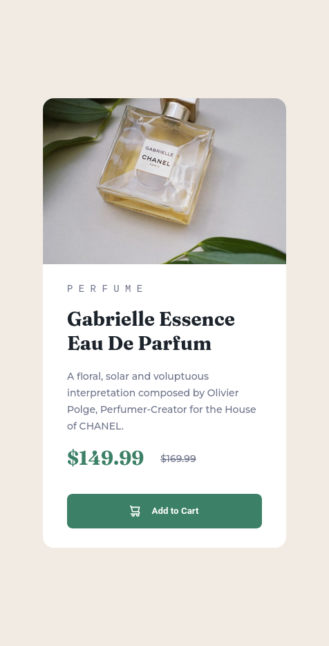

# Frontend Mentor - Product preview card component solution

This is a solution to the [Product preview card component challenge on Frontend Mentor](https://www.frontendmentor.io/challenges/product-preview-card-component-GO7UmttRfa). Frontend Mentor challenges help you improve your coding skills by building realistic projects. 

## Table of contents

- [Overview](#overview)
  - [The challenge](#the-challenge)
  - [Screenshot](#screenshot)
  - [Links](#links)
- [My process](#my-process)
  - [Built with](#built-with)
  - [What I learned](#what-i-learned)
  - [Continued development](#continued-development)
  - [Useful resources](#useful-resources)
- [Author](#author)
- [Acknowledgments](#acknowledgments)

**Note: Delete this note and update the table of contents based on what sections you keep.**

## Overview

I have created this Product preview card with only HTML and CSS

### The challenge

Users should be able to:

- View the optimal layout depending on their device's screen size
- See hover and focus states for interactive elements

### Screenshot




### Links

- Solution URL: [Add solution URL here](https://github.com/kumarmash/product-preview-card-component)
- Live Site URL: [Add live site URL here](https://kumarmash.github.io/product-preview-card-component/)

## My process

### Built with

- HTML5 markup
- CSS custom properties
- Flexbox
- CSS Grid
- Desktop-first workflow then mobile workflow

**Note: These are just examples. Delete this note and replace the list above with your own choices**

### What I learned

In this project I gained knowledge of changing images on the pages based on screen-size i.e mobile/desktop by using <picture> tag.
Best thing about this <picture> tag is that we can easily replace picture based up size of screen without writing any css code for it.
To see how you can add code snippets, see below:

```html
 <picture>
        <source
            srcset="./images/image-product-mobile.jpg"
            media="(max-width : 50rem)"
            >
      

    </picture>
```

I've also learned how to use @media queries which give us power to change the styles based on certain condition like screen widths.
To see how you can add code snippets, see below:

```css
media (max-width: 50rem) {
  main {
    display: flex;
    flex-wrap: wrap;
    max-width: 30rem;
  }

  .product-image {
    max-width: 30rem;
    border-radius: 1rem 1rem 0 0;
  }

  h1 {
    margin-top: 1rem;
  }
}
```

Further more i gained knowledge on how to use Psuedo elements in css like :hover (which triggers when we hover over links or button etc.)

```css
.cart-btn:hover {
  background-color: hsl(158, 43%, 15%);
}
```

### Continued development

I want to focus more on responsive design and how to use all other psuedo elements and classes. Learn grid and flex boxes in more depth.


### Useful resources

- [Resource 1](https://blog.hubspot.com/website/html-space) - This helped me on how to add spaces between letters in html  i.e using <pre> tag.

- [Resource 2] (https://developer.mozilla.org/en-US/docs/Learn/CSS/CSS_layout/Media_queries) -- This helped me learning @media Queries in CSS

## Author

- Website - [Manish Kumar]
- Frontend Mentor - [@kumarmash](https://www.frontendmentor.io/profile/kumarmash)


## Acknowledgments

